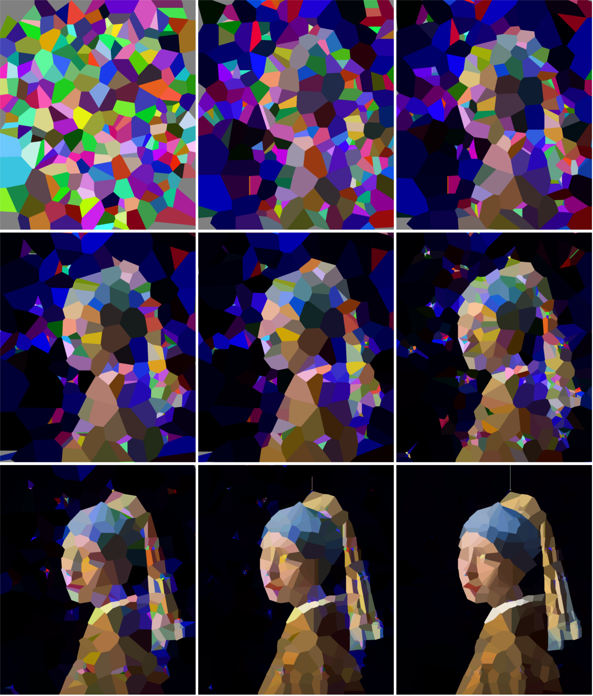
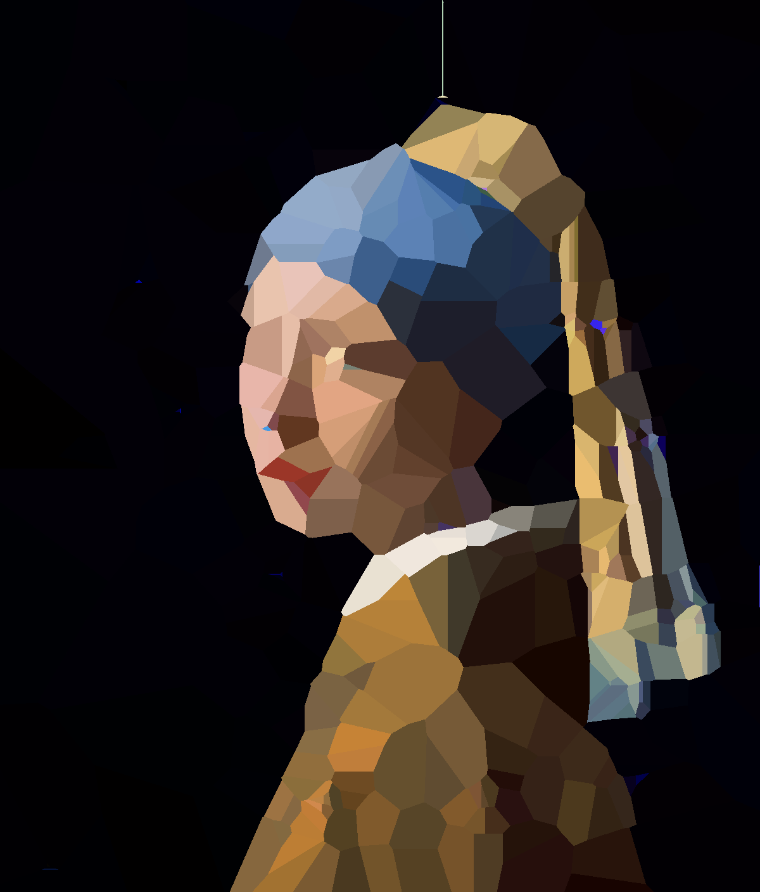

# Genetic Art Algorithm - Part 2

To cope with some issues the previous version had I tried a different approach using Voronoi diagrams/partitions/cells. 
This allows points to be duplicated (which initially doesn't have an effect) and removed more easily. This allows some
new evolutionary steps that mimic biology (like whole genome duplications). You can see the progression from the 1 
generation to generation 5000 below. Between the later images there usually is a duplication step, followed by a number
of normal evolutionary steps, followed by a reduction step. 



The final result after 5600 generations you can check out below



Note that running this code will take a long time, running 5000 generations took several days to complete on my machine.

## Running the code

To run the code in this repository clone it, set up a virtual environment and install the required packages from 
requirements.txt

```bash

git clone https://github.com/4dcu-be/Genetic-Art-Algorithm-part-2
cd Genetic-Art-Algorithm-part-2
python -m venv venv
source venv/bin/activate
pip install -r requirements.txt

```

Next you can run evolve.py and evolve_simple.py using

```bash

python evolve_voronoi.py

```

The paths to the target image and output directory are hard-coded, but can easily be changed. the lines are in the main
routine.

```python
    target_image_path = "./img/girl_with_pearl_earring_half.jpg"
    checkpoint_path = "./output/"
```

